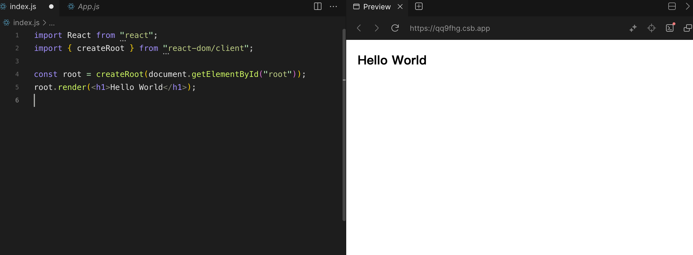
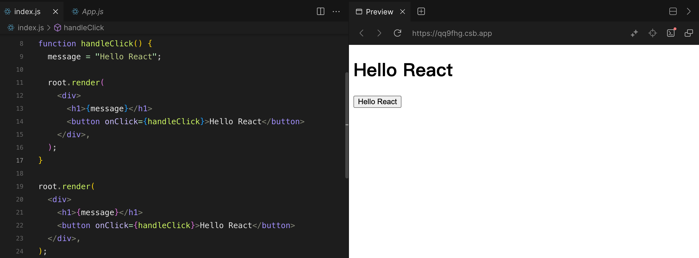
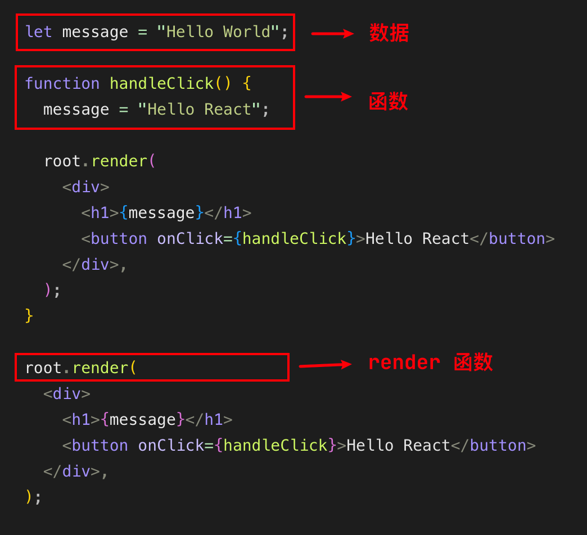

# 一、React 是什么？

**React 是一个用于构建 Web 和原生交互界面的库**。官网描述如下：

- React 让你可以通过组件来构建用户界面；
- React 使用 JS 和标签语法（JSX）编写组件；
- React 组件用数据呈现内容。你可以通过响应交互（例如用户输入）向它们传递新数据。然后，React 将更新屏幕以匹配新数据。

React 的特点：

- 声明式：我们只需要维护组件的状态，当状态改变时，React 可以根据最新的状态去渲染我们的 UI 界面；
- 组件化
- 跨平台：可以使用 Node 进行服务端渲染，ReactNative，用于开发移动端跨平台。

React 包含类组件和函数式组件，随着 React Hook 的流行，类组件逐渐退出舞台，函数式组件是未来的主流，目前 [React 官网](https://react.docschina.org/)**_已经不再提供类组件的文档_**。想查看 React 类组件文档请访问[旧官网](https://legacy.reactjs.org/)。

# 二、React 的开发依赖

开发 React 必须依赖三个库：

- **react**：包含 react 所必须的核心代码；
- **react-dom**：react 渲染在不同平台所需的核心代码；
- **babel**：将 jsx 转换成 React 代码的工具。

# 三、逐步深入 React

React 可以将应用渲染到指定的 DOM 节点上，具体分为两步：

**1、使用 ReactDOM 创建一个根节点**

index.html

```html
<!DOCTYPE html>
<html lang="en">
  <head>
    <meta charset="UTF-8" />
    <meta name="viewport" content="width=device-width, initial-scale=1.0" />
    <title>Document</title>
  </head>
  <body>
    <div id="root"></div>
  </body>
</html>
```

使用 React DOM 在 id 为 root 的 div 上创建一个根节点，之后渲染的内容都会挂载到根节点上：

```javascript
import { createRoot } from "react-dom/client";

const root = createRoot(document.getElementById("root"));
```

**2、使用 render 函数将 React 组件渲染到根节点上**

```jsx
root.render(<h1>Hello World</h>);
```



+++

**接下来我们想在页面上添加一个按钮，点击后 Hello World 会变成 Hello React，那么该如何实现呢？**

我们首先给页面添加一个 Hello React 按钮，并绑定了一个点击事件，当我们点击按钮后，message 变量会从 Hello World 变为 Hello React。但实际点击后，页面的 Hello World 并没有发生变化，这是因为**React 页面每次重新渲染都是通过 render 函数来实现的**。

```jsx
let message = "Hello World";

function handleClick() {
  message = "Hello React";
}

root.render(
  <div>
    <h1>{message}</h1>
    <button onClick={handleClick}>Hello React</button>
  </div>
);
```

在点击事件发生时，我们除了需要更改 message 变量，还需要再次调用 render 函数才能触发渲染：

```jsx
function handleClick() {
  message = "Hello React";

  root.render(
    <div>
      <h1>{message}</h1>
      <button onClick={handleClick}>Hello React</button>
    </div>
  );
}
```

这次再点击 Hello React 按钮，页面就会变为 Hello React 啦：



很容易感觉到这样开发十分麻烦，在实际开发中，我们采用**组件化**的开发模式，一个组件会包含页面构建所需的数据、函数和 render 函数，大大提高了开发效率。



**使用类组件实现组件化：**

```jsx
class App extends React.Component {
  constructor() {
    super();

    this.state = {
      message: "Hello World",
    };
  }

  btnClick() {
    this.setState({
      message: "Hello React",
    });
  }

  render() {
    return (
      <div>
        <h1>{this.state.message}</h1>
        <button onClick={this.btnClick.bind(this)}>Hello React</button>
      </div>
    );
  }
}

root.render(<App />);
```

**使用函数式组件实现组件化：**

```jsx
function App() {
  const [message, setMessage] = useState("Hello World");

  function handleClick() {
    setMessage("Hello React");
  }

  return (
    <div>
      <h1>{message}</h1>
      <button onClick={handleClick}>Hello React</button>
    </div>
  );
}

root.render(<App />);
```

如果看不懂请不用担心，接下来的章节中我会对两种类型的组件进行详解。
