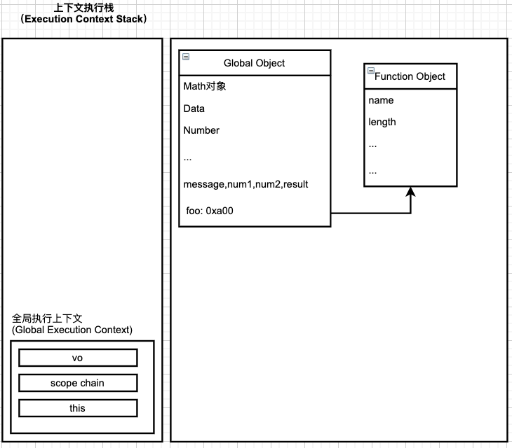
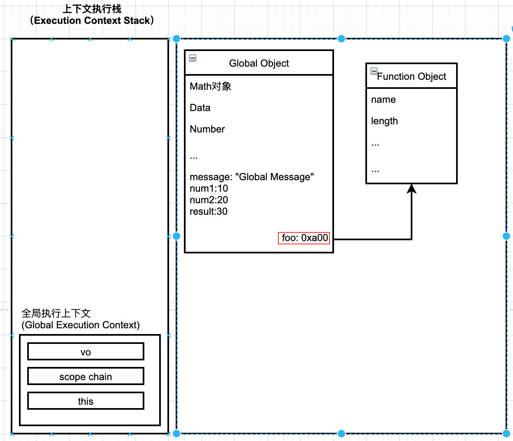
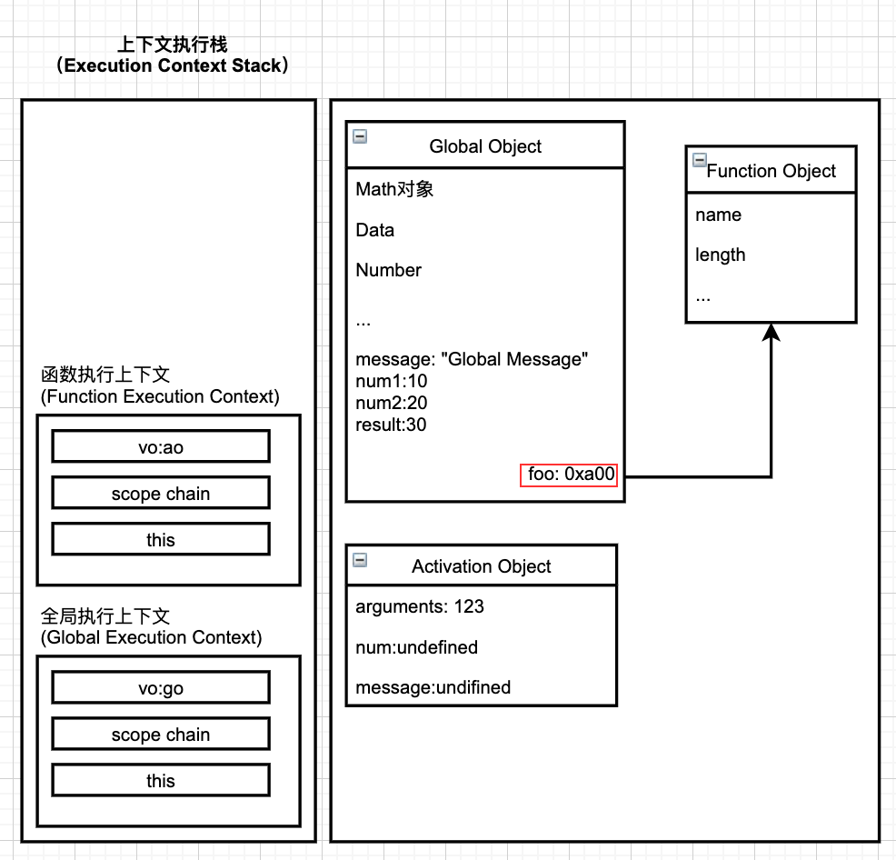
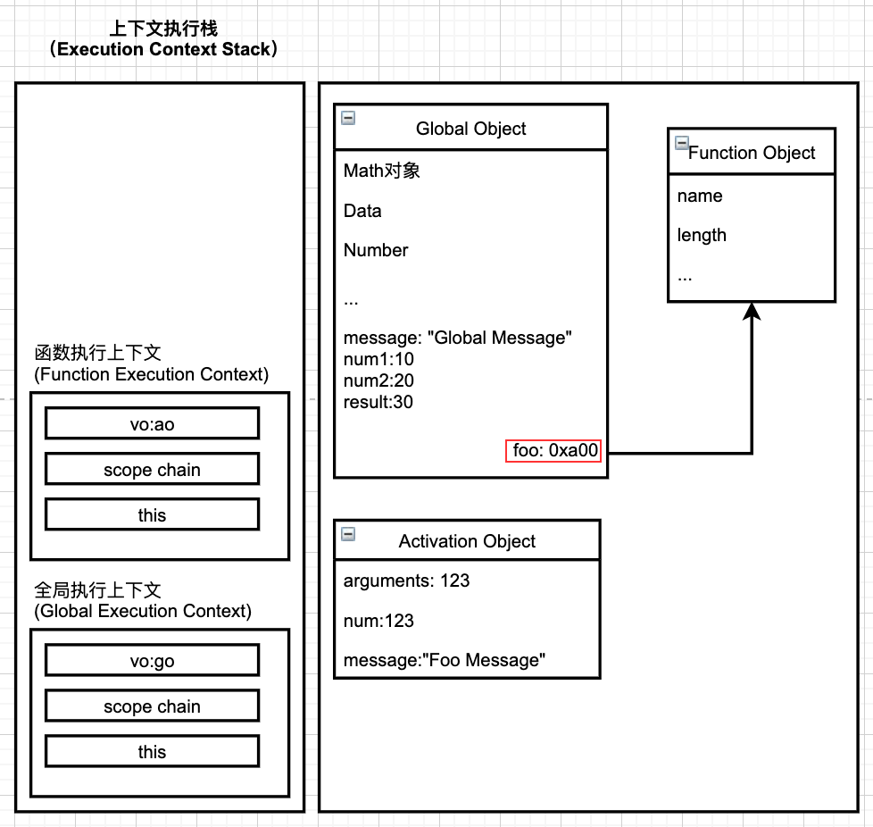
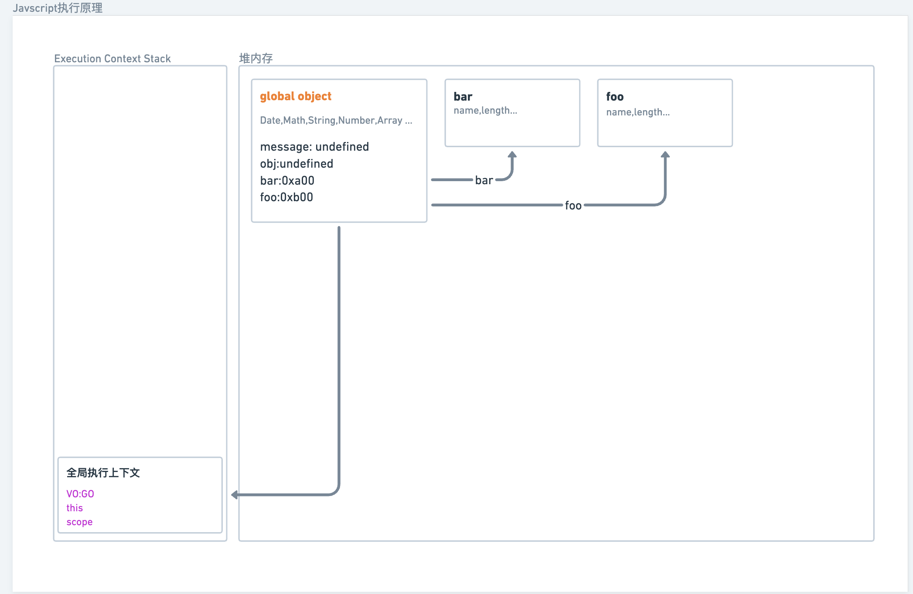
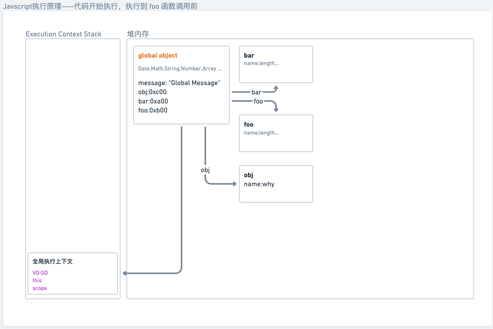
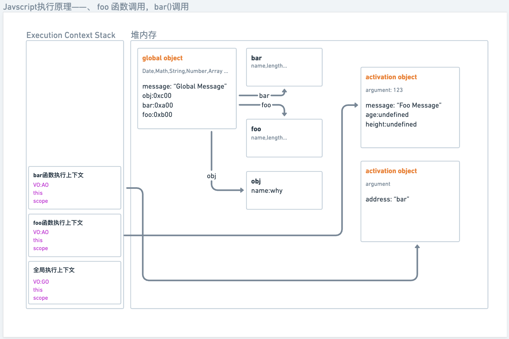
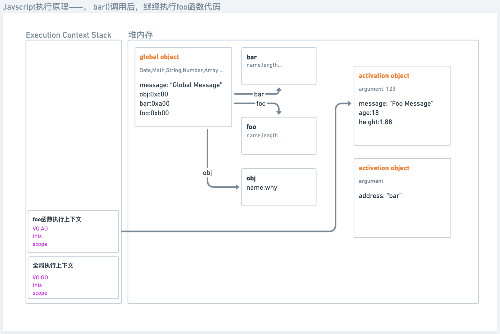
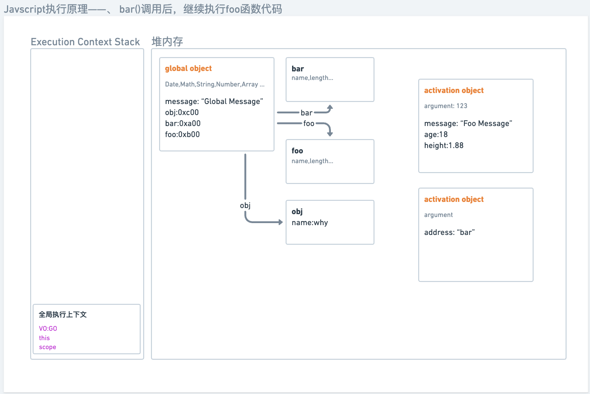

# Javascript执行原理

## 全局代码的执行过程

### 1. 初始化全局对象（Global Object）

js 引擎在**执行代码之前**，会在**堆内存中创建一个全局对象**：Global Object(GO)

+ 该对象在**所有作用域**（scope）中都可以访问；
+ 里面会包含Date、Array、String、Number、setTimeout、setInterval等等；
+ 其中还会有一个**window属性**指向自己。

```javascript
console.log(message, num1, num2)	// undefined,undefined,undefined

var message = "Global Message";

function foo() {
	var message = "Foo Message";
}

var num1 = 10;
var num2 = 20;
var result = num1 + num2;

console.log(result)
```

### 2. 执行上下文（Execution Contexts）

JS 引擎内部有一个执行上下文栈（Execution Context Stack，ECS），它是用于执行代码的调用栈。

初始化全局对象后，JS引擎会构建一个全局执行上下文（Global Execution Context，GEC）。GEC 会被放入 ECS 中，具体会执行两项工作： 

+ 代码执行前，执行上下文都会关联一个VO（Variable Object，变量对象），**全局定义的变量和函数声明**会先被解析为机器可执行的语言并添加到VO中（执行全局代码时，VO 就是 GO）。

  变量和函数此时已经存在，变量的值为 undefined，但函数会先被JS引擎初始化，创建一个函数对象，但该函数对象只包含其原生内容，不包括我们定义在其中的变量及参数。



+ 在代码执行的过程中，会对变量进行赋值，或者执行其他的函数。



## 函数代码的执行过程

以下面的代码为例：

```javascript
console.log(message, num1, num2)	// undefined,undefined,undefined

var message = "Global Message";

function foo(num) {
	var message = "Foo Message";
  console.log(message)
}

foo(123);

var num1 = 10;
var num2 = 20;
var result = num1 + num2;

console.log(result);
```

### 1. 创建执行上下文

在执行过程中遇到函数调用时，会根据函数体创建一个**函数执行上下文**（Function Execution Context，FCS），并且压入ECS中。

**因为每个执行上下文都会关联一个VO，那么函数执行上下文关联的VO是什么呢？**

+ 当函数执行上下文进栈时，会创建一个**AO对象**（Activation Object）；
+ 这个 AO 对象会使用**arguments 进行初始化**，并且**初始值是传入函数的参数**；
+ 这个 AO 对象会作为执行上下文的 VO 来存放变量的初始化。



### 2. 执行代码



## 函数相互调用的执行过程

示例代码：

```javascript
var message = "Global Message";
var obj = {name: "why"};

function bar() {
  console.log("bar function");
  var address = "bar";
}

function foo(num) {
  var message = "Foo message";
  
  bar();
  
  var age = 18;
  var height = 1.88;
  console.log("foo function", num);
}

foo(123);
```

### 1、初始化全局对象并创建执行上下文。

代码执行前的情况：



代码开始执行，执行到 foo 函数调用前：



此时 message，obj的值都初始化完成，接下来开始进行函数调用。

### 2、foo 函数调用，并调用 bar 函数

整体执行顺序如下：

1. foo 函数调用：会创建执行上下文进栈，并生成AO对象初始化变量，接下来执行代码，对message进行赋值。
2. 执行到 bar() 时，会创建 bar 函数的执行上下文并进栈，生成对应的AO对象初始化变量，之后执行bar函数代码，对address 赋值。



### 3、函数调用后

bar 函数调用后，执行上下文会退栈并被销毁，继续执行 foo 函数代码，对 age 和 height 进行赋值：



foo 函数执行完后同样会退栈并被销毁，至此代码执行结束：



## 一、执行上下文 Execution Context

执行上下文进入中，会关联一个**VO对象**、**作用域链 Scope Chain**和this对象。

### 1.1 VO对象

### 1.2 作用域和作用域链

作用域链是一个对象列表，用于变量标识符的求值，

每一个执行上下文都会关联一个作用域链，作用域链是包含一系列对象的列表，会在变量标识符被赋值时被搜索。当我们的代码被解析进入执行上下文后，作用域链就会根据代码类型被创建并初始化一系列对象。

函数被创建时作用域链就已经被确定了。

# 一、执行上下文

# 二、作用域和作用域链